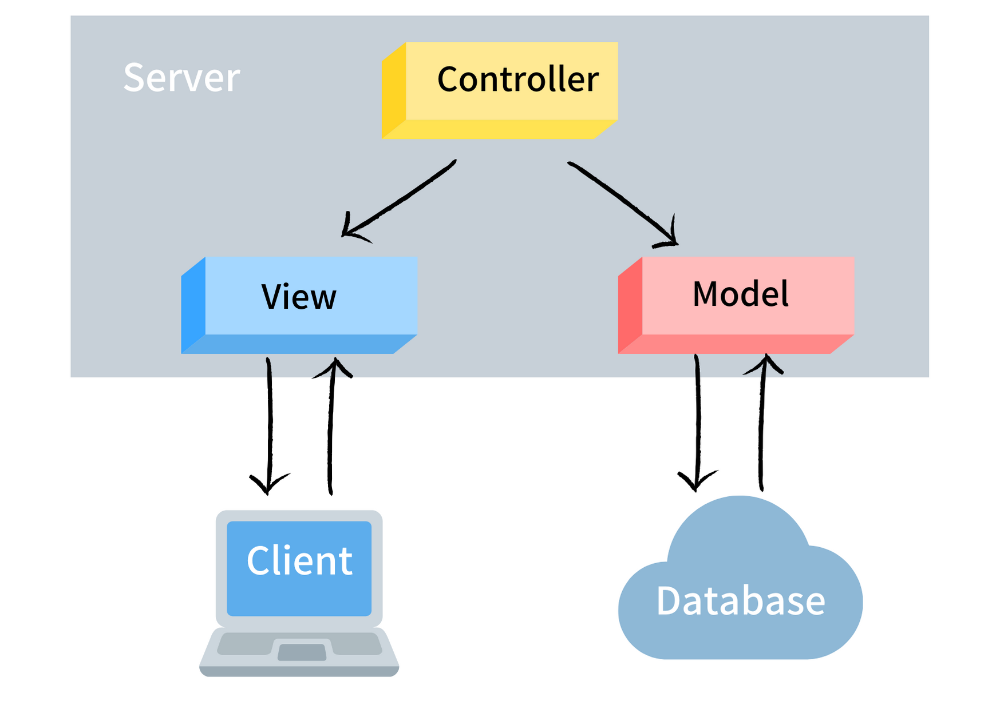
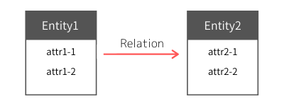

# 目次
1. 基礎知識
2. DB設計
3. SQL

## はじめに
普段なんとなくでDjangoのmodels.pyでデータベース設計を行っている場合、migrate時のエラーの解消に手間取ったり、システムダウンなどの理由でデータベースに直接アクセスする必要が生じた場合に適切な対応がとれなくなる。そのような場合に備え、データベース周りの基本的な知識を身につけておくことは重要。  
今回のセミナーでは、プロジェクトの企画段階からゼロベースでDB設計し、SQLで実装できるようになることを目標とする。  
なお、時間の都合上トランザクションやACID特性など、普段の開発ではあまり意識しない領域の話題や複雑なSQL構文は今回扱わない。

# 1.基礎知識
## システムにおけるDBの立ち位置  
データベースは砕けた言い方をすると、データの保管庫といえる。  
MVCモデルにおけるシステムの模式図は下図のようになる。  
システム上では、データを処理するプログラムとは独立に扱われる。  
さらに、DBとシステムの他の要素の間にはDBMS(database management system)というデータを管理するためのインターフェースが存在し、実際のDBからのデータの入出力はDBMSが行っている。  
複数のシステムで扱われるデータも一つのDBで統一的に管理することも多い。
   

 

## RDBの構造  
RDBは、データを行と列からなる2次元の表で管理。行は個々のデータを、列はデータを構成する要素を表す。  
ある表と別の表の間に関連性を持たせることで複雑なデータ構造を表現する。  
次に、RDBの主な構成要素を示す。  
<dl>
    <dt>・エンティティ</dt>
    <dd>データを格納する大きな単位。テーブルという語も同じような意味で用いられる。</dd>
    <dt>・属性</dt>
    <dd>エンティティ内に格納する具体的な情報。</dd>
    <dt>・リレーション</dt>
    <dd>エンティティ間を関連付ける情報。リレーションには1to1, 1toM, MtoMの3種類がある。また、外部キーは必ず主キーを参照する。(後述)
    </dd>
</dl>

 

## 主キー、外部キー、正規形  
属性のうち、特別な役割を持つものをキーをいう。
<dl>
    <dt>・主キー</dt>
    <dd>各テーブルに1つ存在。データ内容の重複がなく、テーブル内のデータを一意に区別するためのキー。複数の列をまとめて主キー扱いすることもある。</dd>
    <dt>・外部キー</dt>
    <dd>エンティティ間を関連付けるためのキー。</dd>
    <dt>・正規形</dt>
    <dd>データがどれだけ管理しやすい形になっているか。舞台的な話は次章で。</dd>
</dl>
 

## 各種制約(not null, unique)
DBに格納されるデータには内容に制限が課されることがある。最も重要な制約は以下の２つ。
<dl>
    <dt>・not null</dt>
    <dd>データの内容が空の状態で格納されるのを制限する。主キーには必ず付される。</dd>
    <dt>・unique</dt>
    <dd>データ間で内容の重複が起こるのを制限する。主キーには必ず付される。複数のキーをまとめてunique制約を課す場合もある。</dd>
</dl>
 

# 2.DB設計
## DB設計の手順
1. DBに格納する情報を洗い出し、DBの構造を作る。(正規化されていない論理モデルを作成)
2. 論理モデルの修正
    * 正規化：従属関係を排除して、エンティティをできる限り細かい単位に分ける。
3. 物理モデルの設計(どのDBを使うか、サーバーは何を使うか検討)
4. 物理モデルの実装

## ER図の書き方  
以下のWebアプリを用いて説明する。 

[https://erdplus.com/](https://erdplus.com/)
 

## 注意すべき事  
DB設計をするに当たって、注意すべき事柄をいくつか羅列する。
* 管理する必要があるデータのみを含める。
* 必要なデータは全てそろえる。
* 正規化する。
* 1to1で十分なリレーションを1toMやMtoMにしない。1toMで十分なリレーションをMtoMにしない。
* 認証情報、ログ情報は分離するのが望ましい
* MtoMは中間テーブルを作成することで実装
 

## RDBの種類  
代表的なOSSのみ紹介  
* SQLite
* MySQL
* PostgreSQL
* MariaDB

## PostgreSQLの設定

    $sudo /etc/init.d/postgresql start
    $sudo passwd postgres  
    $su - postgres  
    $psql
    #CREATE ROLE {username} LOGIN CREATEDB PASSWORD {password}; 
    #CREATE DATABASE {dbname} OWNER {username};
    #\du
    #\q
    $logout
    $psql --user {username} --dbname {dbname}

# 3.SQL

## SQL基本操作
SQLとは、データベースの構造の定義、データの入出力や抽出を行うためのデータベース言語。

詳細なリファレンスは以下。  
https://www.postgresql.jp/document/10/html/index.html

### postgresql特有のコマンド
* `\q` : 終了
* `\du` : ロール一覧  
* `\l` : DB一覧  
* `\dt` : テーブル一覧
* `\d {table_name}` : テーブル詳細
 

以下に代表的なSQLコマンドをいくつか挙げる。
SQLコマンドは、主にデータの定義に関するものとデータ操作に関するものに分けられる。

### データ定義

#### CREATE TABLE
新しいtableを作成。

    CREATE TABLE {table_name} (
        {first_column_name} text,
        {second_column_name} integer,
    );  

・ オプション

    stock integer DEFAULT 10, # デフォルト値を指定
    price numeric CHECK (price > 0), # 条件に合致しないデータをはじく
    product_name text NOT NULL, # not null制約を付加
    product_id integer UNIQUE, # unique制約を付加

    # PRIMARY KEY は主キーに与える。  
    # NOT NULL かつ UMIQUE を表す。 
    product_id integer PRIMARY KEY,

    # REFERENCES は外部キーに与える。  
    {foreign_key} integer REFERENCES {table_name},
 

#### DROP TABLE
指定したtableを削除。

    DROP TABLE {table_name};
 

#### ALTER TABLE
tableの各種設定を変更する。

    ALTER TABLE {table_name} ADD COLUMN {field_name} {data_type};

コマンドは他にもいろいろあるが時間の関係で割愛。
だが全て `ALTER TABLE {table_name} [ACTION] {…}` 構文で可能。

### データ操作
#### INSERT INTO
tableに新たなデータを挿入する。

    INSERT INTO {table_name} VALUES {value};

`{value}` は `(1, 'student', 3.5)` のように与える。
 

#### UPDATE
table内に存在するデータの値を変更する。

    UPDATE {table_name} SET {column_name} = {value} WHERE {condition};

例えば、 `UPDATE products SET price = 10 WHERE id = 5;` は、`products`テーブル内で`id`が`5`であるデータの、`price`という属性の値を`10`に変更すると言う意味を表す。
 

#### DELETE
table内の、条件に合致するデータを削除する。

    DELETE FROM {table_name} WHERE {condition};

`{table_name}`内の`{condition}`に合致するデータを全て削除。
 

#### SELECT
table内の、条件に合致するデータを取得する。

    SELECT {condition} FROM {table_name};

例えば、 `SELECT * FROM table1;` は`table1`内の全てのデータを取得するという意味。

